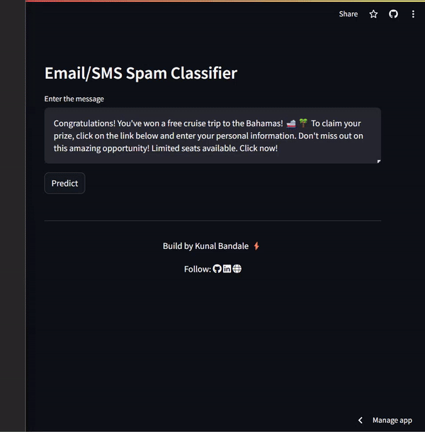

# Email/SMS Spam Classifier

[](https://share.streamlit.io/your_username/your_repository/app.py)

Detect Email/SMS Spam with Machine Learning! This Streamlit web app predicts whether a given message is spam or not. Powered by a trained machine learning model, it preprocesses the input text, applies feature extraction techniques, and then classifies it using Natural Language Processing (NLP) algorithms. Enjoy a seamless experience with mobile-friendly UI and lightning-fast predictions!

## Table of Contents

- [Demo](#demo)
- [Features](#features)
- [Technologies Used](#technologies-used)
- [Installation](#installation)
- [Usage](#usage)
- [Contributing](#contributing)
- [License](#license)

## Demo

Check out the live demo [here](https://sms-email-spam-classifier-c2udcvz62tgshzqodryfyf.streamlit.app/)!



## Features

- Input any text message to classify it as spam or not.
- Mobile-friendly UI for a seamless experience on any device.
- Lightning-fast predictions powered by machine learning.
- Preprocessing and feature extraction done in the backend.
- Easily customizable for your specific use case.

## Technologies Used

[](https://streamlit.io/)
[](https://www.python.org/)
[](https://scikit-learn.org/)
[](https://www.nltk.org/)

## Installation

1. Clone the repository:

   ```bash
   git clone https://github.com/your_username/your_repository.git
   ```

2. Navigate to the project directory:

   ```bash
   cd your_repository
   ```

3. Install the required dependencies:

   ```bash
   pip install -r requirements.txt
   ```

## Usage

1. Run the Streamlit app:

   ```bash
   streamlit run app.py
   ```

2. Open your web browser and go to [http://localhost:8501](http://localhost:8501) to view the app.

3. Enter any text message in the input field and click the "Predict" button to classify it as spam or not.

## Contributing

Contributions are welcome! Please feel free to open a pull request or submit an issue with any suggestions or improvements.

## License

This project is licensed under the [MIT License](LICENSE).
